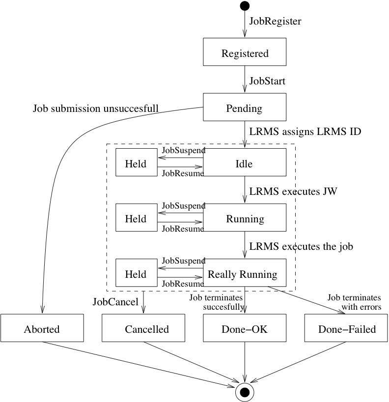

CREAM User's Guide
==================

CREAM Command Line Interface Guide
----------------------------------

This section briefly explains the sequence of operations to be performed
by a user to submit and then manage jobs on CREAM based CEs, referring
to the C++ Command Line Interface (CLI).

Before starting: get your user proxy
~~~~~~~~~~~~~~~~~~~~~~~~~~~~~~~~~~~~

Before using any of the CREAM client commands, it is necessary to have a
valid proxy credential available on the client machine. You can create
it using the ``voms-proxy-init`` command. If you already have a valid
proxy available on your machine just make the ``X509_USER_PROXY``
environment variable point to it.

In order to get a proxy certificate issued by VOMS, you should have in
the directory ``/etc/vomses`` the proper VOMS file containing a line as
follows:

::

    "EGEE" "kuiken.nikhef.nl" "15001" "/O=dutchgrid/O=hosts/OU=nikhef.nl/CN=kuiken.nikhef.nl" "EGEE" "22"

or the corresponding line for your VO. You also need to install the VO
related ``.lsc`` files in the ``/etc/grid-security/vomsdir/<VO>``
directory. In a standard EMI UI installation, these settings should be
already there.

Make moreover sure you have in the directory ``$HOME/.globus`` your
certificate/key pair, i.e. the following files:

-  usercert.pem

-  userkey.pem

Note that file permissions are important: the two files must have
respectively 0600 and 0400 permissions.

Then you can issue the VOMS client command (you will be prompted for the
pass-phrase):

::

    $ voms-proxy-init -voms dteam
    Enter GRID pass phrase:
    Your identity: /C=IT/O=INFN/OU=Personal Certificate/L=Padova/CN=Massimo Sgaravatto
    Creating temporary proxy ................................................................................. Done
    Contacting  voms2.hellasgrid.gr:15004 [/C=GR/O=HellasGrid/OU=hellasgrid.gr/CN=voms2.hellasgrid.gr] "dteam" Done
    Creating proxy .............................. Done

    Your proxy is valid until Sat Apr 30 05:05:49 2011

    $ voms-proxy-info -all
    subject   : /C=IT/O=INFN/OU=Personal Certificate/L=Padova/CN=Massimo Sgaravatto/CN=proxy
    issuer    : /C=IT/O=INFN/OU=Personal Certificate/L=Padova/CN=Massimo Sgaravatto
    identity  : /C=IT/O=INFN/OU=Personal Certificate/L=Padova/CN=Massimo Sgaravatto
    type      : proxy
    strength  : 1024 bits
    path      : /tmp/x509up_u500
    timeleft  : 11:59:55
    key usage : Digital Signature, Key Encipherment, Data Encipherment
    === VO dteam extension information ===
    VO        : dteam
    subject   : /C=IT/O=INFN/OU=Personal Certificate/L=Padova/CN=Massimo Sgaravatto
    issuer    : /C=GR/O=HellasGrid/OU=hellasgrid.gr/CN=voms2.hellasgrid.gr
    attribute : /dteam/Role=NULL/Capability=NULL
    attribute : /dteam/italy/Role=NULL/Capability=NULL
    attribute : /dteam/italy/INFN-PADOVA/Role=NULL/Capability=NULL
    timeleft  : 11:59:55
    uri       : voms2.hellasgrid.gr:15004

CREAM CLI commands
~~~~~~~~~~~~~~~~~~

The most relevant commands to interact with CREAM based CEs are:

-  ::

       glite-ce-job-submit <jdl_file_1> ... <jdl_file_N>

   submits N jobs (N must be >=1) to a CREAM based CE. It requires N JDL
   files as input and returns N CREAM job identifiers.

-  ::

       glite-ce-delegate-proxy <delegation_Id>

   allows the user to delegate her proxy credential to the CREAM
   service. This delegated credential can then be used for job
   submissions.

-  ::

       glite-ce-job-status <job_Id_1> ... <job_Id_N>

   displays information (in particular the states) of N jobs (N must be
   >=1) previously submitted to CREAM based CEs.

-  ::

       glite-ce-job-list <host[:port]>

   lists the identifiers of jobs submitted to a CREAM based CE by the
   user issuing the command.

-  ::

       glite-ce-job-cancel <job_Id_1> ... <job_Id_N>

   cancels N jobs (N must be >=1) previously submitted to CREAM based
   CEs.

-  ::

       glite-ce-job-suspend <job_Id_1> ... <job_Id_N>

   suspends the execution of N jobs (N must be >=1) previously submitted
   to CREAM based CEs.

-  ::

       glite-ce-job-resume <job_Id_1> ... <job_Id_N>

   resumes the execution of N jobs (N must be >=1) which have been
   previously suspended.

-  ::

       glite-ce-job-output <job_Id_1> ... <job_Id_N>

   retrieves the output sandbox files of N jobs (N must be >=1)
   previously submitted to CREAM based CEs.

-  ::

       glite-ce-job-purge <job_Id_1> ... <job_Id_N>

   clears N jobs (N must be >=1) from CREAM based CEs. After this
   operation the purged jobs canRSQUOt be managed anymore.

-  ::

       glite-ce-proxy-renew <delegation_Id_1> ... <delegation_Id_N>

   renews N delegations (N must be >=1), and therefore refreshes the
   proxy of the jobs submitted to CREAM based CEs using the considered
   delegations.

-  ::

       glite-ce-service-info <host[:port]>

   returns information about the CREAM service (version, status, etc.).

-  ::

       glite-ce-enable-submission <host[:port]>

   (re-)enables job submissions on the specified CREAM CE.

-  ::

       glite-ce-disable-submission <host[:port]>

   disables job submissions on the specified CREAM CE.

-  ::

       glite-ce-allowed-submission <host[:port]>

   checks if jobs submissions on the specified CREAM CE are allowed or
   have been disabled.

-  ::

       glite-ce-job-lease <lease_identifier> --endpoint <cream_endpoint> \
                                                      --leaseTime <lease_time>

   create a lease identifier in the CREAM server and associate a time
   duration to it.

Man pages are available for all the CREAM client commands. You can also
access information about the usage of each command by issuing:

::

    $ <command> --help

Submitting jobs to CREAM based CEs
~~~~~~~~~~~~~~~~~~~~~~~~~~~~~~~~~~

To submit jobs to CREAM based CEs, the command ``glite-ce-job-submit``
must be used. The ``glite-ce-job-submit`` command requires as input one
or more job description files; each file describes the job
characteristics and requirements through the JDL (Job Description
Language). A typical example of a JDL job description file is:

::

    [
    Type = "Job";
    JobType = "Normal";
    Executable = "myexe";
    StdInput = "myinput.txt";
    StdOutput = "message.txt";
    StdError = "error.txt";
    InputSandbox = {"/users/seredova/example/myinput.txt",
    "/users/seredova/example/myexe"};
    OutputSandbox = {"message.txt", "error.txt"};
    OutputSandboxBaseDestUri = "gsiftp://se.pd.infn.it/data/seredova";
    ]

Such a JDL would make the ``myexe`` executable be transferred on the
remote CREAM CE and be run taking the ``myinput.txt`` file (also copied
from the client node) as input. The standard streams of the job are
redirected to files ``message.txt`` and ``error.txt``, and when job
completes its execution they are automatically uploaded on
``gsiftp://se.pd.infn.it/data/seredova``.

A detailed description of the available JDL attributes and of the rules
for building correct JDL files is documented in the CREAM JDL
`guide <JDL_Guide.html>`__.

The jobs submitted to a CREAM based CE are given the delegated
credentials of the user who submitted it. These credentials can then be
used when operations requiring security support has to be performed by
the job.

There are two possible options to deal with proxy delegation:

-  asking the automatic delegation of the credentials during the
   submission operation;

-  explicitly delegating credentials, and then asking to rely on these
   previously delegated credentials on the actual submission operations.

It is highly suggested to rely on this latter mechanism, using the same
delegated proxy for multiple job submissions, instead of delegating each
time a proxy. Delegating a proxy, in fact, is an operation that can
require a non negligible time.

The command ``glite-ce-delegate-proxy`` is the command to be used to
explicitly delegate the user credentials to a CREAM CE.The following
shows an example of job submission, performed explicitly delegating
credentials. So first of all the credentials are delegated to a CREAM
based CE (whose endpoint is specified with the option ``--endpoint``
(``-e``):

::

    $ glite-ce-delegate-proxy -e cream-ce-01.pd.infn.it mydelid
    2006-02-26 15:03:37,286 NOTICE - Proxy with delegation id [mydelid] successfully
    delegated to endpoint [https://cream-ce-01.pd.infn.it:8443//ce-cream/services/CREAMDelegation]

The identifier of the delegation is then specified with the
``--delegationId`` (``-D``) option in the job submit operation:

::

    $ glite-ce-job-submit -D mydelid -r cream-ce-01.pd.infn.it:8443/cream-lsf-grid02 myjob1.jdl myjob2.jdl myjob3.jdl

The option ``-r`` (``--resource``) has been used to specify the
identifier of the CREAM CE where the job has to be submitted to.
``myjob1.jdl`` ``myjob2.jdl`` ``myjob3.jdl`` are the 3 JDL files
describing the jobs to be submitted.

The command returns the CREAM job identifiers associated with these jobs
(e.g. ``https://cream-ce-01.pd.infn.it:8443/CREAM116j9vgnf``) which
identify them in clear and unique way all over the Grid system scope.

In addition the user can associate a lease that she/he has previously
created with the command ``glite-ce-job-lease`` by mean of the option
``--leaseId <lease_identifier>``:

::

    $ glite-ce-job-submit -D mydelid -r cream-ce-01.pd.infn.it:8443/cream-lsf-grid02 --leaseId <my_lease_identifier>
    myjob1.jdl myjob2.jdl myjob3.jdl

To create a lease in the CREAM service, with a certain duration of time
(expressed in seconds), issue the command:

::

    $ glite-ce-job-lease --endpoint cream-27.pd.infn.it --leaseTime 3600 myLID
    You requested lease time [3600] for lease ID [myLID]
    CREAM negotiated the lease time to [3600]

The above command has created a lease on ``cream-27.pd.infn.it`` named
"myLID" and lasting 1 hour.

Monitoring jobs
~~~~~~~~~~~~~~~

Passing the CREAM job identifiers returned by the
``glite-ce-job-submit`` command to the ``glite-ce-job-status`` command,
it is possible to monitor the submitted jobs. Several (static and
dynamic) information can be shown, depending on the chosen verbosity
level. The verbosity level can be 0 (less verbosity), 1 or 2 (most
verbosity). Please note that specifying 0 as verbosity level means
calling on the CREAM service a faster operation than when using 1 or 2
as verbosity level. The most relevant attribute is the job status.

The following is an example of job status operation, specifying 1 as
verbosity level:

::

    $ glite-ce-job-status -L 1 https://cream-02.pd.infn.it:8443/CREAM738582717
    ****** JobID=[https://cream-02.pd.infn.it:8443/CREAM738582717]
    Current Status = [DONE-FAILED]
    ExitCode = [N/A]
    FailureReason = [lsf_reason=256; Cannot move ISB (${globus_transfer_cmd}
    gsiftp://cream-02.pd.infn.it//CREAMTests/Exe1/ssh1.sh file:///home/infngrid001/home_cream_738582717/CREAM738582717/ssh1.sh):
    error: globus_ftp_client: the server responded with an error 500 500-Command failed. : globus_l_gfs_file_open failed.
    500-globus_xio: Unable to open file //CREAMTests/Exe1/ssh1.sh
    500-globus_xio: System error in open: No such file or directory
    500-globus_xio: A system call failed: No such file or directory 500 End.]
    Grid JobID = [N/A]

    Job status changes:
    -------------------
    Status = [REGISTERED] - [Tue 22 Jan 2008 15:55:08] (1201013708)
    Status = [PENDING] - [Tue 22 Jan 2008 15:55:08] (1201013708)
    Status = [IDLE] - [Tue 22 Jan 2008 15:55:11] (1201013711)
    Status = [RUNNING] - [Tue 22 Jan 2008 15:55:18] (1201013718)
    Status = [DONE-FAILED] - [Tue 22 Jan 2008 16:03:10] (1201014190)

    Issued Commands:
    -------------------
    *** Command Name = [JOB_REGISTER]
    Command Category = [JOB_MANAGEMENT]
    Command Status = [SUCCESSFULL]
    *** Command Name = [JOB_START]
    Command Category = [JOB_MANAGEMENT]
    Command Status = [SUCCESSFULL]

In this example it is interesting to note that the job failed (as
reported by the ``Current Status`` field) for the problem reported in
the ``FailureReason`` field: the file to be transferred was not found.

Instead of explicitly specifying the identifiers of the jobs to monitor,
the user can also ask to monitor all her jobs, in case specifying
conditions (on the submission date and/or on the job status) that must
be met. For example to monitor all jobs, whose status is DONE-OK or
DONE-FAILED, submitted to the ``grid005.pd.infn.it`` CREAM CE between
July 23, 2005 10:00 and July 28, 2005 11:00, the following command must
be issued:

::

    $ glite-ce-job-status --all -e grid005.pd.infn.it:8443 --from ’2005-07-23 10:00:00’ \
                          --to ’2005-07-28 11:00:00’ -s DONE-OK:DONE-FAILED

Retrieving output of jobs
~~~~~~~~~~~~~~~~~~~~~~~~~

User can choose to save the output sandbox (OSB) files on a remote
server, or save them in the CREAM CE node. In the latter case these
files can then be retrieved using the ``glite-ce-job-output`` command.
For example the following command retrieves the output sandbox files of
the specified job from the relevant CREAM CE node:

::

    $ glite-ce-job-output https://cream-38.pd.infn.it:8443/CREAM295728364
    2011-01-29 10:09:50,394 INFO - For JobID [https://cream-38.pd.infn.it:8443/CREAM295728364]
    output will be stored in the dir ./cream-38.pd.infn.it_8443_CREAM295728364

This command can be used also to retrieve output produced by multiple
jobs, by specifying multiple job identifiers as command's arguments

Getting job identifiers
~~~~~~~~~~~~~~~~~~~~~~~

If a user is interested to get the identifiers of all her jobs submitted
to a specific CREAM CE, she can use the ``glite-ce-job-list`` command.
For example the following command returns the identifiers of all the
jobs submitted to the specified CREAM CE, owned by the user issuing the
command:

::

    $ glite-ce-job-list grid005.pd.infn.it:8443

Cancelling jobs
~~~~~~~~~~~~~~~

In some cases it might be needed to cancel jobs which have been
previously submitted to CREAM based CEs. This can be achieved via the
``glite-ce-job-cancel`` command. E.g., the command:

::

    $ glite-ce-job-cancel https://grid005.pd.infn.it:8443/CREAM115j5vfnf

cancels the specified job.

Suspending and resuming jobs
~~~~~~~~~~~~~~~~~~~~~~~~~~~~

A running or idle job can be suspended (i.e. its execution will be
stopped), and be resumed (i.e. it will run again) later. This can be
achieved with the ``glite-ce-job-suspend`` and ``glite-ce-job-resume``
commands. The following example shows that after having issued the
``glite-ce-job-suspend`` command, after a while the job status becomes
``HELD``.

::

    $ glite-ce-job-suspend https://cream-ce-01.pd.infn.it:8443/CREAM11a79tnb2
    Are you sure you want to suspend specified job(s) [y/n]: y
    $ glite-ce-job-status -L 0 https://cream-ce-01.pd.infn.it:8443/CREAM11a79tnb2
    ****** JobID=[https://cream-ce-01.pd.infn.it:8443/CREAM11a79tnb2]
    Status = [HELD]

Issuing the =glite-ce-job-resume= command, the job will run/will be idle
again:

::

    $ glite-ce-job-resume https://cream-ce-01.pd.infn.it:8443/CREAM11a79tnb2
    Are you sure you want to resume specified job(s) [y/n]: y
    $ glite-ce-job-status -L 0 https://cream-ce-01.pd.infn.it:8443/CREAM11a79tnb2
    ****** JobID=[https://cream-ce-01.pd.infn.it:8443/CREAM11a79tnb2]
    Status = [REALLY-RUNNING]

Purging jobs
~~~~~~~~~~~~

A CREAM job can be monitored (via the =glite-ce-job-status=) even after
it has completed its execution. A job gets "lost"; (i.e. it is not
possible to monitor or manage it anymore) only when the user who
submitted it decides to explicitly clear it, or when the CREAM system
administrator decides to do this purging operation. A user can purge her
own jobs, using the ``glite-ce-job-purge`` command. E.g., after having
issued the command:

::

    $ glite-ce-job-purge https://cream-ce-01.pd.infn.it:8443/CREAM116jbi4o0

the specified job canRSQUOt be managed anymore (e.g. it is not possible
to check its status anymore).

Renewing proxies
~~~~~~~~~~~~~~~~

It is possible that long jobs may outlive the validity of the initial
delegated credentials; if so the job will die prematurely. To avoid this
it is possible to renew the proxy of jobs submitted to CREAM CEs with
the ``glite-ce-proxy-renew`` command. E.g. the following command:

::

    $ glite-ce-proxy-renew -e cream-ce-01.pd.infn.it:8443 mydelid

renews the proxy of all the jobs having ``mydelid`` as delegation id. It
must be stressed that for jobs submitted to CREAM based CEs via the
Workload Management System (WMS), proxy renewal is automatically dealt
by the middleware.

Handling job identifiers
~~~~~~~~~~~~~~~~~~~~~~~~

Handling the job identifiers directly quickly becomes tedious. To avoid
this, you can make the ``glite-ce-job-submit`` and ``glite-ce-job-list``
commands append the job Id(s) to a named file using the ``--output``
(``-o``) option. On the other side, the CREAM client commands which take
job identifier(s) as argument accept also the ``--input`` (``-i``)
option which allows the job identifier(s) to be read from a file. The
following shows an example:

::

    $ glite-ce-job-submit -a -r cream-ce-01.pd.infn.it:8443/cream-lsf-grid02 -o idfile myjob.jdl
    https://cream-ce-01.pd.infn.it:8443/CREAM116jbs5b9

The returned job id got also inserted in the specified file
(``idfile``), which can be specified with the ``--input`` (``-i``)
option e.g. with the ``glite-ce-job-status`` command:

::

    $ glite-ce-job-status -i idfile
    ****** JobID=[https://cream-ce-01.pd.infn.it:8443/CREAM116jbs5b9]
    Status=[REALLY-RUNNING]

Restricting job submissions
~~~~~~~~~~~~~~~~~~~~~~~~~~~

In order to prevent that a CREAM CE gets overloaded, the CREAM CE
administrator can set a specific policy to disable new job submissions
when certain conditions are met. If submissions are disabled because of
that, if newer job submissions are attempted, users will get an error
message such as:

::

    $ glite-ce-job-submit -a -r cream-38.pd.infn.it:8443/cream-pbs-creamtest1 oo.jdl
    MethodName=[jobRegister] ErrorCode=[0] Description=[The CREAM service cannot accept jobs at the moment]
    FaultCause=[Threshold for Load Average(1 min): 30 => Detected value for Load Average(1 min): 31.13]
    Timestamp=[Sat 29 Jan 2011 11:55:18]

In order to avoid degrading the performance of the system, the specified
policy is not evaluated for each job submission, but instead it is
evaluated and imposed from time to time (so it might happen that for a
short time job submissions are allowed even if the specified threshold
has been reached). CREAM "super-users"; can also disable newer job
submissions via the command ``glite-ce-disable-submission``. Submissions
can then be re-enabled by a CREAM "super-user"; via the command
``glite-ce-enable-submission``. To check if job submissions on a
specific CREAM CE are allowed, the command
``glite-ce-allowed-submission`` can be used.

::

    $ glite-ce-disable-submission grid006.pd.infn.it:8443
    Operation for disabling new submissions succeeded

    $ glite-ce-allowed-submission grid006.pd.infn.it:8443
    Job Submission to this CREAM CE is disabled

    $ glite-ce-enable-submission grid006.pd.infn.it:8443
    Operation for enabling new submissions succeeded

    $ glite-ce-allowed-submission grid006.pd.infn.it:8443
    Job Submission to this CREAM CE is enabled

It must be stressed that if job submissions to a specific CREAM CE are
disabled, all other operations (job status, job cancellations, etc.) can
still be performed.

Getting information about the CREAM service
~~~~~~~~~~~~~~~~~~~~~~~~~~~~~~~~~~~~~~~~~~~

It is possible to get information about the CREAM service (interface and
service version, status, etc) using the ``glite-ce-service-info``
command, e.g.:

::

    $ glite-ce-service-info cream-13.pd.infn.it:8443
    Interface Version = [2.1]
    Service Version = [1.12]
    Description = [CREAM 2]
    Started at = [Tue Nov 10 14:42:12 2009]
    Submission enabled = [YES]
    Status = [RUNNING]
    Service Property = [SUBMISSION_THRESHOLD_MESSAGE]->
    [Threshold for Load Average
    (1 min): 10 => Detected value for Load Average(1 min): 0.03
    Threshold for Load Average(5 min): 10 => Detected value for Load Average(5 min): 0.03
    Threshold for Load Average(15 min): 10 => Detected value for Load Average(15 min): 0.00
    Threshold for Memory Usage: 95 => Detected value for Memory Usage: 57.41%
    Threshold for Swap Usage: 95 => Detected value for Swap Usage: 2.02%
    Threshold for Free FD: 500 => Detected value for Free FD: 204500
    Threshold for tomcat FD: 800 => Detected value for Tomcat FD: 107
    Threshold for FTP Connection: 30 => Detected value for FTP Connection: 1
    Threshold for Number of active jobs: -1 => Detected value for Number of active jobs: 0
    Threshold for Number of pending commands: -1 => Detected value for Number of pending commands: 0

CREAM CLI configuration files
~~~~~~~~~~~~~~~~~~~~~~~~~~~~~

The configuration of the CREAM UI is accomplished via three possible
configuration files:

-  A general configuration file. This file is looked for in
   ``/etc/glite_cream.conf``

-  A VO specific configuration file. This file is looked for in
   ``/etc/<VO>/glite_cream.conf``

-  A user specific configuration file. This file is looked for in the
   following order:

   -  The file specified with the ``--conf`` option of the considered
      command

   -  The file referenced by the ``$GLITE_CREAM_CLIENT_CONFIG``
      environment variable

   -  ``$HOME/.glite/<VO>/glite_cream.conf`` (if the VO is defined), or
      ``$HOME/.glite/glite_cream.conf`` otherwise

Each of these files is a classad containing definitions. If the same
attribute is defined in more configuration file, the definition in the
user specific configuration file (if any) is considered. Likewise the
definitions in the VO specific configuration file have higher priority
than the ones specified in the general configuration file. It must be
noted that one or more (even all) of these three configuration files can
be missing.

We list here the possible attributes that can be specified in the
configuration files:

+---------------------------------+----------------------------------------------------------------------------------------------------------------------------------------------------------------------------------------------------------------------------+------------------------------------------+
| Name                            | Description                                                                                                                                                                                                                | Default                                  |
+=================================+============================================================================================================================================================================================================================+==========================================+
| CREAM\_URL\_PREFIX              | the prefix to the ``<hostname>:<port>`` to build the CREAM service endpoint                                                                                                                                                | https://                                 |
+---------------------------------+----------------------------------------------------------------------------------------------------------------------------------------------------------------------------------------------------------------------------+------------------------------------------+
| CREAMDELEGATION\_URL\_PREFIX    | the prefix to the ``<hostname>:<port>`` to build the CREAM delegation service endpoint                                                                                                                                     | https://                                 |
+---------------------------------+----------------------------------------------------------------------------------------------------------------------------------------------------------------------------------------------------------------------------+------------------------------------------+
| DEFAULT\_CREAM\_TCPPORT         | the port to be appended to the hostname (if not specified by the user) to build the CREAM and CREAM delegation service endpoint                                                                                            | 8443                                     |
+---------------------------------+----------------------------------------------------------------------------------------------------------------------------------------------------------------------------------------------------------------------------+------------------------------------------+
| CREAM\_URL\_POSTFIX             | the postfix to be appended to the ``<hostname>:<port>`` to build the CREAM service endpoint                                                                                                                                | /ce-cream/services/CREAM2                |
+---------------------------------+----------------------------------------------------------------------------------------------------------------------------------------------------------------------------------------------------------------------------+------------------------------------------+
| CREAMDELEGATION\_URL\_POSTFIX   | the postfix to be appended to the ``<hostname>:<port>`` to build the CREAM delegation service endpoint                                                                                                                     | /ce-cream/services/gridsite-delegation   |
+---------------------------------+----------------------------------------------------------------------------------------------------------------------------------------------------------------------------------------------------------------------------+------------------------------------------+
| JDL\_DEFAULT\_ATTRIBUTES        | the classad that must be included by default in the user's JDLs                                                                                                                                                            | empty classad                            |
+---------------------------------+----------------------------------------------------------------------------------------------------------------------------------------------------------------------------------------------------------------------------+------------------------------------------+
| STATUS\_VERBOSITY\_LEVEL        | the default verbosity level to be used for the ``glite-ce-job-status`` command                                                                                                                                             | 0                                        |
+---------------------------------+----------------------------------------------------------------------------------------------------------------------------------------------------------------------------------------------------------------------------+------------------------------------------+
| UBERFTP\_CLIENT                 | is the pathname of the ``uberftp`` client executable                                                                                                                                                                       | /usr/bin/uberftp                         |
+---------------------------------+----------------------------------------------------------------------------------------------------------------------------------------------------------------------------------------------------------------------------+------------------------------------------+
| SUBMIT\_LOG\_DIR                | the directory where by default the log file ``glite-ce-job-submit_CREAM_<username>_<date>_<time>.log`` (created when the ``--debug`` option is used with the ``glite-ce-job-submit`` command) is created                   | /tmp/glite\_cream\_cli\_logs             |
+---------------------------------+----------------------------------------------------------------------------------------------------------------------------------------------------------------------------------------------------------------------------+------------------------------------------+
| DELEGATE\_LOG\_DIR              | the directory where by default the log file ``glite-ce-delegate-proxy_CREAM_<username>_<date>_<time>.log`` (created when the ``--debug`` option is used with the ``glite-ce-delegate-proxy`` command) is created           | /tmp/glite\_cream\_cli\_logs             |
+---------------------------------+----------------------------------------------------------------------------------------------------------------------------------------------------------------------------------------------------------------------------+------------------------------------------+
| STATUS\_LOG\_DIR                | the directory where by default the log file ``glite-ce-job-status_CREAM_<username>_<date>_<time>.log`` (created when the ``--debug`` option is used with the glite-ce-job-status command) is created                       | /tmp/glite\_cream\_cli\_logs             |
+---------------------------------+----------------------------------------------------------------------------------------------------------------------------------------------------------------------------------------------------------------------------+------------------------------------------+
| LIST\_LOG\_DIR                  | the directory where by default the log file ``glite-ce-job-list_CREAM_<username>_<date>_<time>.log`` (created when the ``--debug`` option is used with the ``glite-ce-job-list`` command) is created                       | /tmp/glite\_cream\_cli\_logs             |
+---------------------------------+----------------------------------------------------------------------------------------------------------------------------------------------------------------------------------------------------------------------------+------------------------------------------+
| SUSPEND\_LOG\_DIR               | the directory where by default the log file ``glite-ce-job-suspend_CREAM_<username>_<date>_<time>.log`` (created when the ``--debug`` option is used with the ``glite-ce-job-suspend`` command) is created                 | /tmp/glite\_cream\_cli\_logs             |
+---------------------------------+----------------------------------------------------------------------------------------------------------------------------------------------------------------------------------------------------------------------------+------------------------------------------+
| RESUME\_LOG\_DIR                | the directory where by default the log file ``glite-ce-job-resume_CREAM_<username>_<date>_<time>.log`` (created when the ``--debug`` option is used with the ``glite-ce-job-resume`` command) is created                   | /tmp/glite\_cream\_cli\_logs             |
+---------------------------------+----------------------------------------------------------------------------------------------------------------------------------------------------------------------------------------------------------------------------+------------------------------------------+
| CANCEL\_LOG\_DIR                | the directory where by default the log file ``glite-ce-job-cancel_CREAM_<username>_<date>_<time>.log`` (created when the ``--debug`` option is used with the ``glite-ce-job-cancel`` command) is created                   | /tmp/glite\_cream\_cli\_logs             |
+---------------------------------+----------------------------------------------------------------------------------------------------------------------------------------------------------------------------------------------------------------------------+------------------------------------------+
| JOBOUTPUT\_LOG\_DIR             | the directory where by default the log file ``glite-ce-job-output_CREAM_<username>_<date>_<time>.log`` (created when the ``--debug`` option is used with the ``glite-ce-job-output`` command) is created                   | /tmp/glite\_cream\_cli\_logs             |
+---------------------------------+----------------------------------------------------------------------------------------------------------------------------------------------------------------------------------------------------------------------------+------------------------------------------+
| PURGE\_LOG\_DIR                 | the directory where by default the log file ``glite-ce-job-purge_CREAM_<username>_<date>_<time>.log`` (created when the ``--debug`` option is used with the ``glite-ce-job-purge`` command) is created                     | /tmp/glite\_cream\_cli\_logs             |
+---------------------------------+----------------------------------------------------------------------------------------------------------------------------------------------------------------------------------------------------------------------------+------------------------------------------+
| ALLOWEDSUB\_LOG\_DIR            | the directory where by default the log file ``glite-ce-allowed-submission_CREAM_<username>_<date>_<time>.log`` (created when the ``--debug`` option is used with the ``glite-ce-allowed-submission`` command) is created   | /tmp/glite\_cream\_cli\_logs             |
+---------------------------------+----------------------------------------------------------------------------------------------------------------------------------------------------------------------------------------------------------------------------+------------------------------------------+
| ENABLE\_LOG\_DIR                | the directory where by default the log file ``glite-ce-enable-submission_CREAM_<username>_<date>_<time>.log`` (created when the ``--debug`` option is used with the ``glite-ce-enable-submission`` command) is created     | /tmp/glite\_cream\_cli\_logs             |
+---------------------------------+----------------------------------------------------------------------------------------------------------------------------------------------------------------------------------------------------------------------------+------------------------------------------+
| DISABLE\_LOG\_DIR               | the directory where by default the log file ``glite-ce-disable-submission_CREAM_<username>_<date>_<time>.log`` (created when the ``--debug`` option is used with the ``glite-ce-disable-submission`` command) is created   | /tmp/glite\_cream\_cli\_logs             |
+---------------------------------+----------------------------------------------------------------------------------------------------------------------------------------------------------------------------------------------------------------------------+------------------------------------------+
| PROXYRENEW\_LOG\_DIR            | the directory where by default the log file ``glite-ce-proxy-renew_CREAM_<username>_<date>_<time>.log`` (created when the ``--debug`` option is used with the ``glite-ce-proxy-renew`` command) is created                 | /tmp/glite\_cream\_cli\_logs             |
+---------------------------------+----------------------------------------------------------------------------------------------------------------------------------------------------------------------------------------------------------------------------+------------------------------------------+
| GETSERVICEINFO\_LOG\_DIR        | the directory where by default the log file ``glite-ce-service-info_CREAM_<username>_<date>_<time>.log`` (created when the ``--debug`` option is used with the ``glite-ce-service-info`` command) is created               | /tmp/glite\_cream\_cli\_logs             |
+---------------------------------+----------------------------------------------------------------------------------------------------------------------------------------------------------------------------------------------------------------------------+------------------------------------------+
| LEASE\_LOG\_DIR                 | the directory where by default the log file ``glite-ce-job-lease_CREAM_<username>_<date>_<time>.log`` (created when the ``--debug`` option is used with the ``glite-ce-job-lease`` command) is created                     | /tmp/glite\_cream\_cli\_logs             |
+---------------------------------+----------------------------------------------------------------------------------------------------------------------------------------------------------------------------------------------------------------------------+------------------------------------------+

As mentioned above, if the same attribute is defined in more than a
configuration file, the definition in the user specific configuration
file (if any) has higher priority than the definition in the VO specific
configuration file (if any) which has higher priority than the
definition in the generic configuration file. If an attribute is not
defined anywhere, the default value is considered.

Use specific functionality of the CREAM CE
------------------------------------------

Forward of requirements to the batch system
~~~~~~~~~~~~~~~~~~~~~~~~~~~~~~~~~~~~~~~~~~~

The CREAM CE allows to forward, via tha BLAH component, requirements to
the batch system. For this purpose the JDL ``CERequirements`` attribute,
described in the CREAM JDL `guide <JDL_Guide.html>`__, can be used. For
direct submissions to the CREAM CE (e.g. jobs submitted to the CREAM CE
using the CREAM CLI ``glite-ce-job-submit`` command) the CeRequirements
attribute is supposed to be filled by the end-user. For jobs submitted
to the CREAM CE via the WMS, the ``CeRequirements`` attribute is instead
filled by the WMS, considering the JDL ``Requirements`` expression and
the value of the ``CeForwardParameters`` attribute in the WMS
configuration file.

For example, if in the user JDL there is :

::

    Requirements= "other.GlueHostMainMemoryRAMSize > 100 && other.GlueCEImplementationName==\"CREAM\"";

and if the WMS configuration file there is:

::

    CeForwardParameters  = {"GlueHostMainMemoryVirtualSize","GlueHostMainMemoryRAMSize", "GlueCEPolicyMaxCPUTime"};

in the JDL sent by the WMS to CREAM there will be:

::

    CeRequirements= "other.GlueHostMainMemoryRAMSize > 100";

The ``CERequirements`` expression received by CREAM is then forwarded to
BLAH. Basically BLAH manages the ``CERequirements`` expression setting
some environment variables, which are available and can be properly used
by the ``/usr/libexec/xxx_local_submit_attributes.sh`` script (e.g.
``/usr/libexec/pbs_local_submit_attributes.sh`` for PBS/Torque,
``/usr/libexec/lsf_local_submit_attributes.sh`` for LSF). This script
must be properly created by the site admin.

For example, considering the following CeRequirements expression:

::

    CeRequirements="other.GlueHostMainMemoryRAMSize > 100 && other.GlueCEStateWaitingJobs <10 && \
    other.GlueCEImplementationName==\"CREAM\" && other.GlueHostProcessorClockSpeed >= 2800 && \
    (Member(\"FDTD\", other.GlueHostApplicationSoftwareRuntimeEnvironment))";

the following settings will be available in
``$USR_LOCATION/libexec/xxx_local_submit_attributes.sh``:

::

    GlueHostMainMemoryRAMSize_Min='100'
    GlueCEStateWaitingJobs_Max='10'
    GlueCEImplementationName='CREAM'
    GlueHostProcessorClockSpeed_Min='2800'
    GlueHostApplicationSoftwareRuntimeEnvironment='"FDTD"'

where the value for $USR\_LOCATION in a standard installation of a CREAM
CE is "/usr". What is printed by the
``/usr/libexec/xxx_local_submit_attributes.sh`` script is automatically
added to the submit command file. For example if the JDL
``CeRequirements`` expression is:

::

    CeRequirements = "(Member(\"FDTD\", other.GlueHostApplicationSoftwareRuntimeEnvironment))";

and the =/usr/libexec/pbs\_local\_submit\_attributes.sh= is:

::

    #!/bin/sh
    if [ "$other.GlueHostApplicationSoftwareRuntimeEnvironment" == "FDTD" ]; then
     echo "#PBS -l software=FDTD"
    fi

then the PBS submit file that will be used will include:

::

    ...
    ...
    # PBS directives:
    #PBS -S /bin/bash
    #PBS -o /dev/null
    #PBS -e /dev/null
    #PBS -l software=FDTD
    ....
    ....

where the line:

::

    #PBS -l software=FDTD

is set via the ``/usr/libexec/pbs_local_submit_attributes.sh`` script.

Please note that there are no differences if in ``CeRequirements``
expresssion there is e.g.

::

    CeRequirements = other.xyz==\"ABC\"

or:

::

    CeRequirements = "xyz==\"ABC\"";

In both cases in ``/usr/libexec/xxx_local_submit_attributes.sh`` the
variable ``xyz`` will be set. As shown above, having ``x>a`` or ``x>=a``
doesn't make any difference in the setting of the environment variable
``x`` in the ``/usr/libexec/xxx_local_submit_attributes.sh`` script. It
will be in both cases:

::

     x_Min='a' 

Starting with BLAH v. 1.18 it is possible to forward to the batch system
also other attributes not included in the ``CeRequiments`` JDL
attribute. This can be done adding in =/etc/blah.config= the line:

::

    blah_pass_all_submit_attributes=yes

In this way the ``xxx_local_submit_attributes.sh`` will see the
following environment variables set:

-  gridType

-  x509UserProxyFQAN

-  uniquejobid

-  queue

-  ceid

-  VirtualOrganisation

-  ClientJobId

-  x509UserProxySubject

It is also possible to specify that only some attributes must be
forwarded in the batch system setting in ``blah.config`` e.g.:

::

    blah_pass_submit_attributes[0]="x509UserProxySubject"
    blah_pass_submit_attributes[1]="x509UserProxyFQAN"

CREAM job states
----------------

Here below is provided a brief description of the meaning of each
possible state a CREAM job can enter:

-  ``REGISTERED``: the job has been registered but it has not been
   started yet.

-  ``PENDING`` the job has been started, but it has still to be
   submitted to the LRMS abstraction layer module (i.e. BLAH).

-  ``IDLE``: the job is idle in the Local Resource Management System
   (LRMS).

-  ``RUNNING``: the job wrapper, which "encompasses"; the user job, is
   running in the LRMS.

-  ``REALLY-RUNNING``: the actual user job (the one specified as
   Executable in the job JDL) is running in the LRMS.

-  ``HELD``: the job is held (suspended) in the LRMS.

-  ``CANCELLED``: the job has been cancelled.

-  ``DONE-OK``: the job has successfully been executed.

-  ``DONE-FAILED``: the job has been executed, but some errors occurred.

-  ``ABORTED``: errors occurred during the "management"; of the job,
   e.g. the submission to the LRMS abstraction layer software (BLAH)
   failed.

-  ``UNKNOWN``: the job is an unknown status.

The following figure shows the possible job states transitions:

